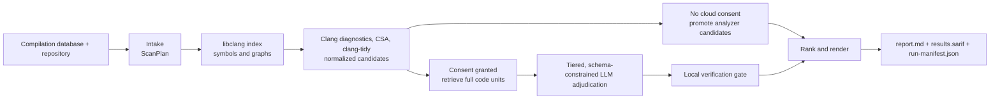

# Architecture and flow

## Product shape

C Audit is a C/C++ auditing pipeline, not a generic LLM agent. Its deterministic
parts discover and preserve evidence; its optional cloud component proposes an
adjudication; its deterministic gate controls what reaches a confirmed report.

The live entry point is `caudit.application.scan.run_scan`. Its declared stages are
`intake`, `index`, `candidates`, `expansion`, `adjudication`, `verification`, and
`report` (`application/stages.py`). Stages have explicit statuses (`ok`, `degraded`,
`failed`, `skipped`) and are recorded in the manifest.

## Scan execution

1. **Intake** (`intake/`) resolves the repository revision, parses and validates
   `compile_commands.json`, expands response files, filters units, and computes build
   coverage. It refuses missing, invalid, or materially incomplete build context
   unless the user explicitly accepts partial coverage.
2. **Index** (`index/`) parses selected translation units through libclang and builds
   symbols plus call, reference, include, macro, and type relationships. Parse gaps are
   visible limitations; they are not silently treated as clean code.
3. **Candidate generation** (`analyzers/`) runs compiler diagnostics, Clang Static
   Analyzer, and the curated clang-tidy profile when available. It normalizes each
   diagnostic into a `Candidate`, preserves provenance, then deduplicates without
   deleting its evidence sources.
4. **Baseline branch:** without cloud consent, `application.pipeline.promote_only`
   turns every candidate into the deterministic analyzer-only report. No provider is
   created, so this branch cannot open a network connection by accident.
5. **Model branch:** with consent, candidates are visited in a stable
   path/line/id order. For each one, structural retrieval captures whole relevant
   code units, the provider returns typed JSON, and the gate verifies the proposal.
6. **Reporting** (`report/` plus `finding_policy/`) splits confirmed findings from
   review-required items, ranks the two sections independently, writes the three
   artifacts, and records configuration, policy versions, tools, coverage, stages,
   hashes, and model usage in the manifest.

## Failure semantics are deliberate

- A later-stage failure must not make an earlier diagnostic disappear. Each candidate
  produces exactly one report item: confirmed or review-required with a machine-readable
  reason.
- Typed `CauditError` failures in degradable stages yield a partial report and
  limitations; unexpected exceptions are bugs and should propagate rather than being
  converted into a deceptively successful run.
- A translation unit that cannot parse is an indexed coverage gap, not by itself a
  partial run. A stage that fails or degrades is a partial run and cannot exit `0`.
- A skipped stage (especially no-cloud adjudication) is distinct from a failed stage.
- No analyzer running is an environment failure, not a clean report.

## Architectural intent vs. implementation location

The 13 numbered plan documents in [`my_docs/plan/`](../my_docs/plan/00-overview.md)
describe why each capability exists. The implementation is organized by capability
rather than by plan number:

| Capability | Primary packages |
| --- | --- |
| Configuration, CLI, exit codes | `config/`, `cli/`, `status.py` |
| Contracts and stable IDs | `model/` |
| Intake and compilation database | `intake/` |
| Static analysis | `analyzers/` |
| Parsed-code graph | `index/` |
| Evidence and source resolution | `evidence/` |
| Retrieval and budgets | `retrieval/` |
| Consent, prompts, provider, cache, accounting | `llm/` |
| Deterministic verification | `verify/` |
| Promotion, claim provenance, ranking | `finding_policy/` |
| Artifacts and renderers | `report/` |
| Pipeline/use cases | `application/` |
| Metrics and corpus tooling | `eval/` |

When changing a cross-cutting behavior, follow the data flow forward: model/config →
producer → pipeline → report/manifest → test/schema. Do not add a shortcut that lets
one stage recreate inputs another stage already made authoritative.
